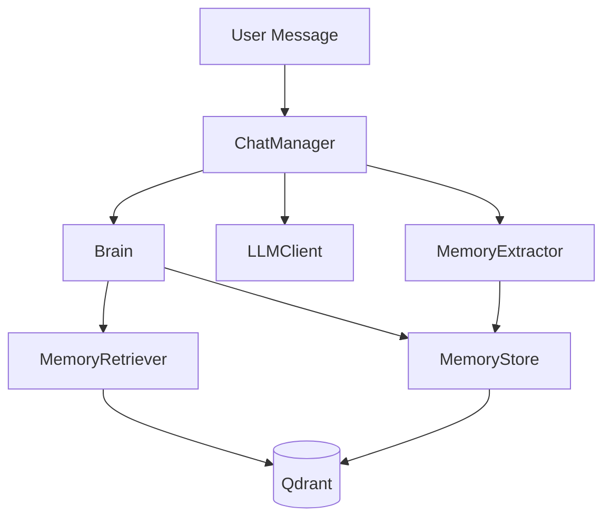

<div align="center">

# NeuroMem

### Memory Layer for AI Assistants

[](https://www.python.org/)
[](https://qdrant.tech/)
[](https://ollama.com/)
[](https://amenra.github.io/ranx/)

Persistent memory, semantic retrieval, and evaluation tooling for building assistants that remember users over time.

</div>

---

## Why NeuroMem

NeuroMem gives your assistant a practical long-term memory stack:

- Store user facts and events as structured memories.
- Retrieve relevant memories with semantic search + ranking.
- Use memory in chat responses automatically.
- Evaluate retrieval quality with reproducible test cases.
- Convert Label Studio annotations into evaluation-ready datasets.

## Core Capabilities

| Capability | What it does |
|---|---|
| Memory storage | Stores episodic and semantic memories with metadata |
| Smart retrieval | Combines similarity with importance and recency signals |
| Chat integration | Runs retrieve -> respond -> extract -> store loop |
| Provider flexibility | Ollama and Gemini embedding/LLM options |
| Evaluation suite | Retrieval, deduplication, and performance evaluation |
| Dataset tooling | Label Studio conversion and dataset exploration scripts |

## System Architecture



## Repository Layout

```text
NeuroMem/
|- app/                  # CLI entrypoints
|- ai/                   # Chat and LLM integration
|- core/                 # Brain orchestrator
|- memory/               # Store/retrieve/extraction/embeddings
|- intelligence/         # Ranking, scoring, decay
|- db/                   # Qdrant vector store
|- models/               # Memory/user models
|- evaluation/           # Eval runners, evaluators, converters, data
|- config/               # Runtime settings
|- docker-compose.yml    # Ollama + Qdrant + Label Studio
```

---

## Quick Start

### 1) Start services

```bash
docker compose up -d
```

This starts:

- `ollama` on `11434`
- `qdrant` on `6333`
- `label-studio` on `8080`

### 2) Create environment and install

```bash
python -m venv .venv
# Windows PowerShell
.\.venv\Scripts\Activate.ps1
pip install -r requirements.txt
```

### 3) Configure `.env`

Minimal local setup:

```env
llm_provider=ollama
ollama_base_url=http://localhost:11434/v1
ollama_model=qwen2.5:3b-instruct

embedding_provider=ollama
ollama_embedding_model=embeddinggemma

qdrant_host=localhost
qdrant_port=6333
qdrant_collection_name=ai_brain_memories
```

### 4) Try memory commands

```bash
python -m app.cli remember "User likes Ethiopian food" -u demo -t semantic -g food
python -m app.cli recall "what food does the user like?" -u demo -k 5
python -m app.cli chat -u demo
```

---

## CLI Commands

| Command | Purpose |
|---|---|
| `python -m app.cli remember ...` | Store memory |
| `python -m app.cli recall ...` | Search memories |
| `python -m app.cli forget ...` | Delete memory by id |
| `python -m app.cli context ...` | Build LLM-ready memory context |
| `python -m app.cli chat ...` | Interactive memory-enabled chat |
| `python -m app.cli stats ...` | Basic user memory stats |

Examples:

```bash
python -m app.cli remember "User works remotely" -u alice -t semantic
python -m app.cli recall "where does alice work" -u alice --top-k 3
python -m app.cli forget <memory_id> -u alice
```

---

## Python API

```python
from core.brain import Brain
from models.memory import MemoryType

brain = Brain(user_id="alice")

brain.remember(
    content="Alice likes long-distance running",
    memory_type=MemoryType.SEMANTIC,
    importance_score=0.8,
    tags=["fitness"]
)

results = brain.recall("What sports does Alice do?", top_k=5)
for r in results:
    print(r.final_score, r.memory.content)
```

---

## Evaluation Workflow

### Run full evaluation

```bash
python -m evaluation.run_eval
```

Outputs include retrieval metrics (Precision@3, Recall@5, nDCG, MRR, MAP), deduplication metrics, and performance benchmarks.

### Use custom test cases

```bash
python -c "from evaluation.run_eval import run_all; run_all('evaluation/data/test_cases_from_label_studio.json')"
```

### Convert Label Studio export -> test_cases format

```bash
python -m evaluation.converters.from_label_studio \
  --input-path evaluation/data/project-1-at-2026-03-18-02-30-cc045d7f.json \
  --output-path evaluation/data/test_cases_from_label_studio.json
```

### Create Label Studio tasks from unlabeled scenarios

```bash
python -m evaluation.converters.to_label_studio
```

### Explore memory datasets (including script-based fallback)

```bash
python -m evaluation.exploration.explore_memoryBench \
  --dataset-id bavard/personachat_truecased \
  --split test
```

For `bavard/personachat_truecased`, the script includes a fallback loader for raw Hub JSON files when `datasets` blocks script-based loaders.

---

## Providers and Configuration

Main settings are defined in `config/settings.py` and loaded from `.env`.

| Setting | Default | Notes |
|---|---|---|
| `llm_provider` | `ollama` | `ollama` or `gemini` |
| `embedding_provider` | `ollama` | `ollama` or `gemini` |
| `ollama_model` | `qwen2.5:3b-instruct` | Chat model |
| `ollama_embedding_model` | `embeddinggemma` | Embedding model |
| `qdrant_host` | `localhost` | Qdrant host |
| `qdrant_port` | `6333` | Qdrant port |
| `langsmith_tracing` | `false` | Optional tracing |

---

## Label Studio Notes

- Docker route is the easiest: `http://localhost:8080`.
- In Python environments >= 3.13, the project installs `label-studio-sdk` instead of full `label-studio` package due upstream build issues.
- If you need full local CLI on Windows, use Docker or a Python 3.12 virtual environment dedicated to Label Studio.

---

## Development

```bash
pytest
```

Useful utility scripts live under `utils/` for data checks, embedding checks, and evaluation debugging.

---

## License

MIT
